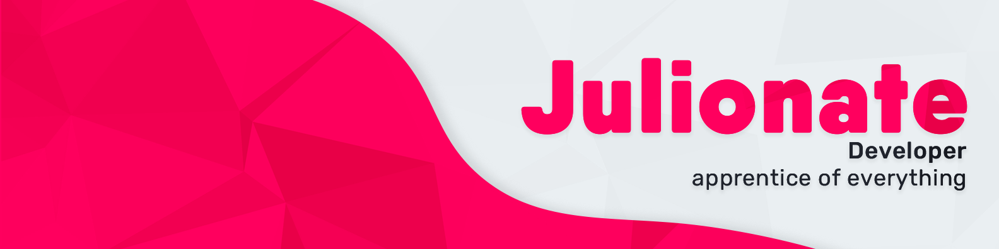

# 👋 Hi, I'm Julio!

Soy desarrollador de software. He trabajado en algunos proyectos personales y colaborativos donde aprendí diversas tecnologías.

<picture>
  <source media="(prefers-color-scheme: dark)" srcset="banner-dark.png">
  <source media="(prefers-color-scheme: light)" srcset="banner-light.png">
  
</picture>

## Conocimientos

Poseo diversos conocimientos tanto en lenguajes de programación, frameworks de desarrollo web y backend, y frameworks de desarrollo de aplicaciones móviles.

### Lenguajes de programación:

- JavaScript + Typescript.
- JSX + TSX.
- Python.

### Frameworks

- Astro & Islands (Sitios web).
- React (Aplicaciones web).
- Preact & Signals (Aplicaciones web).
- TailwindCSS (Estilado de sitios/aplicaciones web).
- Express.
- React Native (Aplicaciones móviles).
- Expo (Aplicaciones móviles).
- Tauri (Aplicaciones de escritorio).

### Otros

- Git y GitHub

## Contacto

**Correo electrónico: julionate@pm.me**
