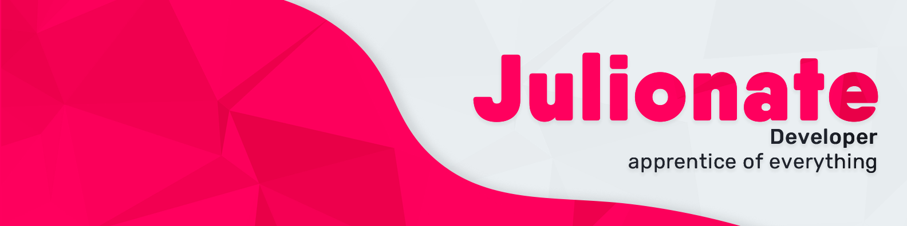

# 👋 Hi, I'm Julio!

I'm a developer. I have worked in some personal and collaborative projects where I learned a lot of new stuff.

<picture>
  <source media="(prefers-color-scheme: dark)" srcset="banner-dark.png">
  <source media="(prefers-color-scheme: light)" srcset="banner-light.png">
  
</picture>

## My knowledges

I have diverse knowledge in programming languages, frontend and backend frameworks, mobile application frameworks and more.

### Programming languages:

- Javascript + Typescript.
- Python.
- Now I'm learning Rust! :)

### Frameworks

- AstroJS.
- React.
- Preact.
- TailwindCSS.
- Express.
- React Native.
- Expo.
- Tauri.

### Others

- Git and GitHub.

## Contact

**Email: julionate@pm.me**
